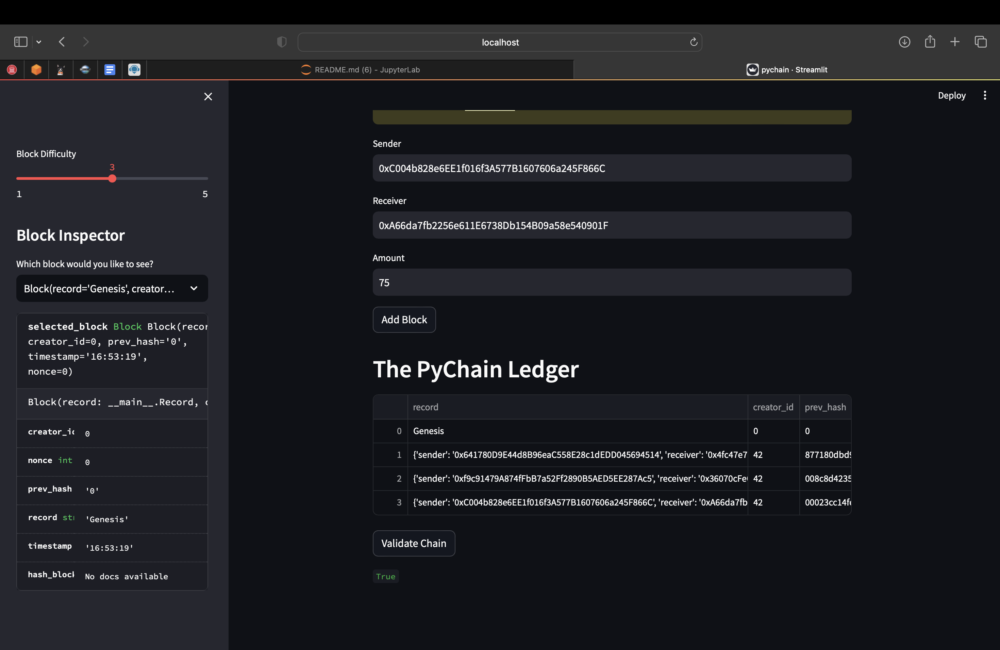

# PyChain Ledger

You’re a fintech engineer who’s working at one of the five largest banks in the world. You were recently promoted to act as the lead developer on their decentralized finance team. Your task is to build a blockchain-based ledger system, complete with a user-friendly web interface. This ledger should allow partner banks to conduct financial transactions (that is, to transfer money between senders and receivers) and to verify the integrity of the data in the ledger.

You’ll make the following updates to the provided Python file for this assignment, which already contains the basic `PyChain` ledger structure that you created throughout the module:

1. Create a new data class named `Record`. This class will serve as the blueprint for the financial transaction records that the blocks of the ledger will store.

2. Modify the existing `Block` data class to store `Record` data.

3. Add Relevant User Inputs to the Streamlit interface.

4. Test the PyChain Ledger by Storing Records.

---
## Submission

You’ll upload the Python file for this assignment to your GitHub repository.

* Make sure to update the `README.md` file to include an explanation of the Steamlit application, a screenshot or video of your deployed Streamlit application, and any other information that’s needed to interact with your project.

* Building the Web interface, you can input the sender, receiver addresses, as well as the amount to send a transaction to anyone. The Block inspector give you a little insight of some of the variables and what they consist of in the code. When adding the block, The PyChain ledger automatically updates and shows you the record of the transaction, sender, receiver, creater Id and so forth. To verify that the addresses and transaction is valid, press the "Validate chain" button and it will output a True or False. 

© 2021 Trilogy Education Services, a 2U, Inc. brand. All Rights Reserved.
